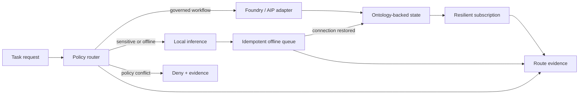

# Palantir AIP × Local-First AI

An independent reference architecture for combining governed Palantir Foundry
workflows with local inference, offline resilience, and auditable routing.

> This is a community project by [John Wantz Jr.](https://github.com/wantzjt).
> It is not affiliated with, endorsed by, or sponsored by Palantir Technologies.
> It uses synthetic data and adapter interfaces—never customer data or private
> Palantir materials.

## Why this exists

Enterprise AI rarely lives in one runtime. Some work belongs in a governed
platform; some must remain on a device; and unreliable connectivity cannot be
allowed to silently corrupt state. This repository makes those boundaries
explicit and testable.



## What it demonstrates

- Classification-aware execution decisions with explicit denial states
- A loopback-only guard for local model endpoints
- An idempotent offline mutation queue with conflict handling
- Subscription recovery for stale or interrupted ontology views
- Evidence records that explain why each important decision occurred
- A synthetic end-to-end example, automated tests, and CI

This is a small, inspectable architecture—not a production Palantir connector.
The `FoundryAdapter` boundary is where a generated OSDK client or approved API
integration belongs.

## Run it

Requires Node.js 20 or newer.

```bash
npm ci
npm run check
npm run example
```

## Repository map

- [`src/`](src/) — reusable routing, inference, queue, and subscription primitives
- [`test/`](test/) — behavior and failure-mode tests
- [`examples/reference-flow.ts`](examples/reference-flow.ts) — synthetic end-to-end flow
- [`docs/architecture.md`](docs/architecture.md) — decisions and integration boundaries
- [`docs/palantir-readiness.md`](docs/palantir-readiness.md) — production readiness checklist
- [`docs/case-study.md`](docs/case-study.md) — the engineering story and tradeoffs
- [`docs/provenance.md`](docs/provenance.md) — what was consolidated and intentionally excluded
- [`docs/references.md`](docs/references.md) — primary Palantir documentation

## Principles

1. Policy decides placement; model preference does not.
2. “Local” is a verified network boundary, not a marketing label.
3. Offline writes are queued, deduplicated, and reconciled deliberately.
4. Subscription failure is visible and recoverable.
5. Claims must be backed by code, tests, or clearly labeled design intent.

## License

Apache-2.0. See [LICENSE](LICENSE).
